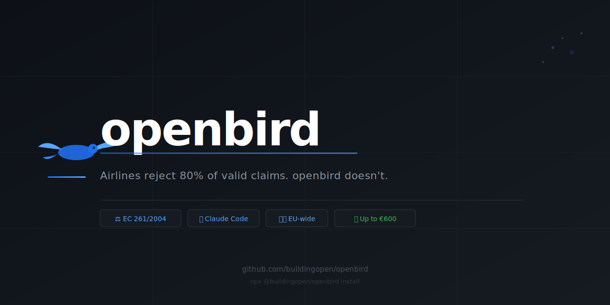
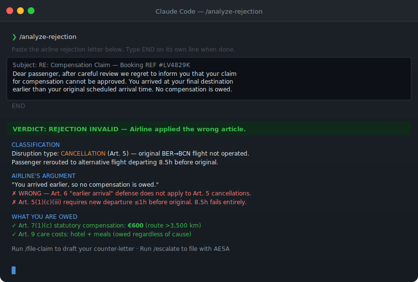

<!-- meta: openbird — Claude Code skills for EU flight compensation under EC 261/2004. Analyze airline rejections, counter bad legal arguments, claim €250–€600. Works with AESA and ECC-Net. -->

<p align="center">
  
</p>

<p align="center">
  <a href="https://www.npmjs.com/package/@buildingopen/openbird"></a>
  <a href="https://pypi.org/project/openbird/"></a>
  <a href="LICENSE"></a>
  
</p>

<br/>

# openbird

> Airlines reject ~80% of valid EC 261/2004 claims hoping passengers give up. openbird doesn't give up.

Airlines are billion-dollar corporations with legal teams. Every rejection letter is written to sound authoritative enough that you'll stop. Most passengers do. openbird gives you the legal precision to push back — it installs Claude Code skills that know EC 261/2004 article by article, identify the exact error in your rejection letter, and tell you what to file, where, and why you'll win.

**This is not a form-filling service.** It's legal firepower in your terminal.

---

## What you're owed ⚖️

Under **EC Regulation 261/2004**, when your flight is cancelled or significantly delayed:

| Route | Compensation per passenger |
|---|---|
| ✈️ Flights ≤ 1,500 km | **€250** |
| 🇪🇺 Intra-EU flights > 1,500 km | **€400** |
| 🌍 Non-EU flights 1,500 – 3,500 km | **€400** |
| 🌐 All other flights (intercontinental, > 3,500 km) | **€600** |

Plus **Art. 9 care costs** — hotel, meals, transport — owed regardless of cause. Even if the airline claims extraordinary circumstances. Even if they say the weather made it unavoidable. You are still owed care.

> **Applies to:** any flight departing an EU airport (any airline), OR arriving at an EU airport on an EU carrier.

---

## See it in action

<p align="center">
  
</p>

*Real analysis of a real rejection tactic. The airline claimed "you arrived earlier, so no compensation." That argument is only valid for delay claims (Art. 6). The flight was cancelled. Art. 5 applies. The passenger was owed €600.*

---

## Quick start (30 seconds)

```bash
npx @buildingopen/openbird install
```

That's it. Skills are copied into `.claude/skills/`. Open Claude Code in any project directory and the commands are live.

```bash
# Or with pip
pip install openbird && openbird install

# Or clone directly
git clone https://github.com/buildingopen/openbird && cd openbird && claude
```

Then in Claude Code:

```
/analyze-rejection
/file-claim
/escalate
```

---

## Skills

| Command | What it does | When to use |
|---|---|---|
| `/analyze-rejection` | Paste your rejection letter. Claude identifies every legal error, gives a VALID/INVALID verdict, and cites the exact articles the airline got wrong. | You have a rejection and want to know if you have a case. |
| `/file-claim` | Drafts a formal claim letter with correct article citations, calculated compensation amounts, and a 14-day ultimatum. | First contact or following up after a rejection. |
| `/escalate` | Identifies the right enforcement authority (AESA, ECC-Net, LBA, CAA) and prepares your complaint filing. | The airline has ignored you or rejected you twice. |

---

## Real case

**The flight:** Berlin BER → Barcelona BCN → San Francisco SFO. Marketed by LEVEL, first leg operated by Vueling.

**What happened:** BER→BCN leg cancelled. Placed on a rerouted flight from a *different airport*, departing **8.5 hours before** the original.

**The rejection:** *"You arrived at your final destination earlier than scheduled. No compensation is owed."*

**Why that's legally wrong:** That argument applies to delay claims under Art. 6. The original flight was cancelled — Art. 5 applies. Under Art. 5(1)(c)(iii), the compensation exemption requires the new departure to be no more than 1 hour before the original. 8.5 hours fails the test entirely. The airline also tried to redirect to Vueling — also wrong, because Art. 13 puts full liability on the marketing carrier (LEVEL).

**The outcome:** Formal counter-letter sent. AESA ADR02 filed. ECC-Net Germany filed in parallel. Airline paid.

**Amount:** €600 statutory compensation + documented care costs (hotel, meal, missed non-refundable accommodation).

---

## How it works

```
1. Paste rejection letter      →    2. Run /analyze-rejection    →    3. Get counter-argument
   (any airline, any language)           (Claude identifies                + filing instructions
                                          the legal error)                  + authority + template
```

openbird works because airlines make the same six mistakes in rejection letters, over and over. The regulation text is precise. When the airline's argument doesn't match the text, you win — if you know which text to cite.

---

## Authorities covered

| Authority | Country / Scope | Binding? | Best for |
|---|---|---|---|
| **AESA** | Spain + all Spanish carriers (Vueling, Iberia, LEVEL, Air Europa) | ✅ Yes — ADR02 | Spanish carriers regardless of departure |
| **ECC-Net Germany** | Germany-based claimants, any EU airline | Mediation | Cross-border cases, parallel pressure |
| **LBA** | German-registered carriers | ✅ Yes | Lufthansa, Condor, Eurowings |
| **CAA** | UK (post-Brexit UK261) | ✅ Yes | Flights to/from UK |
| **DGAC** | France | ✅ Yes | Air France, French departures |
| **ENAC** | Italy | ✅ Yes | Italian carriers, Italian departures |
| **ILT** | Netherlands | ✅ Yes | KLM, Amsterdam departures |

---

## Common airline rejection tactics — and why they fail

Airlines have a playbook. Here are the six moves they use and the article that defeats each one:

| What the airline says | Why it fails |
|---|---|
| "You arrived earlier, so no compensation" | Art. 6 logic. If the original flight didn't operate, it's Art. 5. Arrival time is irrelevant. |
| "Extraordinary circumstances" | Defeats Art. 7 only. Art. 9 care (hotel, meals) is owed in all cases. |
| "File with the operating carrier" | Art. 13. Marketing carrier bears full liability. Their internal arrangements with the operator are not your problem. |
| "You accepted the rebooking" | Accepting the only available flight does not waive your right to compensation. |
| "You didn't request assistance at the airport" | Art. 9 creates a right. The airline must offer it. You can reclaim documented costs retrospectively. |
| "The new flight departed less than 1h early" | Check the actual times. Airlines frequently misstate the departure window. |

---

## File structure

```
openbird/
├── CLAUDE.md                    # Legal context loaded into every Claude session
├── skills/
│   ├── analyze-rejection.md     # /analyze-rejection skill
│   ├── file-claim.md            # /file-claim skill
│   └── escalate.md              # /escalate skill
├── guides/
│   ├── your-rights.md           # What EC 261/2004 actually says
│   ├── aesa.md                  # How to file with Spain's AESA
│   ├── eccnet.md                # How to file with ECC-Net Germany
│   └── counter-arguments.md     # The six rejection tactics and how to defeat each
└── templates/
    ├── initial-claim.md         # First letter to the airline
    ├── escalation-notice.md     # Final notice before regulatory escalation
    └── aesa-complaint.md        # AESA ADR02 complaint text
```

---

## Contributing

If you've won an EC 261/2004 case with an argument, authority, or carrier situation not covered here — open a PR. Real won cases are the most valuable content in this repo. Include: what the airline argued, what article defeated it, which authority you filed with, and the outcome.

---

## Disclaimer

This is practical information about a regulation that has binding legal force across the EU. It is not legal advice. The legal positions described here are drawn from the text of EC 261/2004 and from a real case — not from a lawyer. For complex or high-value claims, consult a solicitor or a no-win-no-fee claims service.

That said: airlines routinely reject valid claims because most passengers won't push back. The information here is accurate enough to push back effectively.

---

## License

MIT — free to use, fork, and extend.

---

<p align="center">
  <sub>Built from a real case. Maintained by <a href="https://github.com/buildingopen">buildingopen</a>.</sub>
</p>
